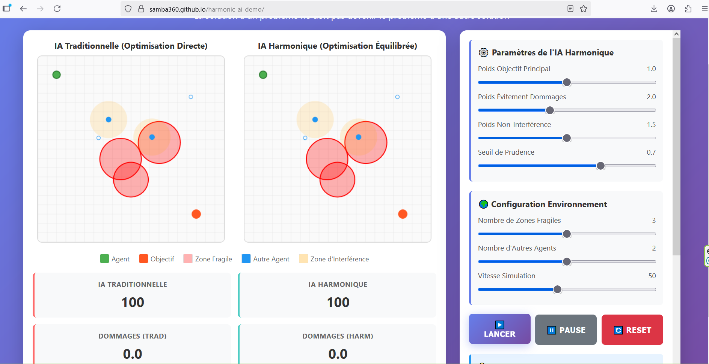

# 🤖 Harmonic AI - Interactive Demonstration

[](https://samba360.github.io/harmonic-ai-demo/)
[](https://arxiv.org/)
[](LICENSE)

## 🌟 Overview

**Harmonic AI** is a novel approach to AI alignment that shifts from aggressive optimization to dynamic harmonization. This interactive demonstration illustrates the core principle:

> "The solution to one problem must not become the problem of another solution."

## 🎯 Key Innovation

Traditional AI optimizes single objectives, often creating negative externalities. Harmonic AI explicitly models and minimizes interference between multiple objectives, seeking balance rather than blind optimization.

## 🚀 Live Demo

**[Try the Interactive Demo Here](https://samba360.github.io/harmonic-ai-demo/)**


### Features

- **Real-time parameter adjustment** - See immediate impact of weight changes
- **Dynamic environment** - Add obstacles and modify conditions on the fly  
- **Side-by-side comparison** - Traditional RL vs Harmonic AI
- **Live metrics** - Track damage, interference, and harmony scores

## 📊 What You'll See

The demo shows two AI agents navigating the same environment:

1. **Traditional RL Agent** (Left)
   - Optimizes directly for the goal
   - Ignores collateral damage
   - Often interferes with other agents

2. **Harmonic AI Agent** (Right)
   - Balances multiple objectives
   - Avoids fragile zones
   - Minimizes interference with others
   - Achieves goal with minimal negative externalities

## 🎮 How to Use

1. **Adjust Parameters**
   - Goal Weight: Importance of reaching objective
   - Safety Weight: Importance of avoiding damage
   - Interference Weight: Importance of not disrupting others
   - Prudence Threshold: Risk aversion level

2. **Configure Environment**
   - Number of fragile zones (0-6)
   - Number of other agents (0-4)
   - Simulation speed

3. **Interactive Elements**
   - Click on canvas to add obstacles
   - Start/Pause/Reset simulation
   - Observe real-time metrics

## 📈 Metrics Explained

- **Score**: 100 - (damage + interference × 5)
- **Damage**: Cumulative harm to fragile zones
- **Interference**: Disruption caused to other agents
- **Energy**: Total movement cost
- **Steps**: Number of actions taken

## 🔬 Scientific Contribution

This work introduces:
- **Interference Matrix**: Mathematical formalization of inter-objective conflicts
- **Effect Taxonomy**: Classification of side effects (irreversible, cascade, emergent, delayed, contextual)
- **Systemic Validation**: Global context evaluation rather than isolated action assessment
- **Theoretical Guarantees**: Proofs of existence and convergence

## 📄 Citation

If you use this work in your research, please cite:

```bibtex
@article{harmonicai2024,
  title={Harmonic AI: Solving Without Harming Through Multi-Objective Prudent Optimization},
  author={Rosny MASSAMBA},
  journal={arXiv preprint arXiv:.},
  year={2024}
}
```

## 🛠️ Local Development

To run locally:

```bash
# Clone the repository
git clone https://github.com/samba360/harmonic-ai-demo.git
cd harmonic-ai-demo

# Open in browser (no build needed - pure HTML/JS)
open index.html
# or
python -m http.server 8000
# then navigate to http://localhost:8000
```

## 📚 Related Resources

- [Full Paper (PDF)](paper.pdf) - Detailed mathematical framework and proofs
- [Extended Code](https://github.com/samba360/harmonic-ai) - Python implementation with RL environments
- [Blog Post](https://medium.com/@samba360) - Non-technical explanation
- [Video Presentation](https://youtube.com) - 5-minute overview

## 🤝 Contributing

We welcome contributions! Please see [CONTRIBUTING.md](CONTRIBUTING.md) for guidelines.

### Areas for Contribution
- Additional test environments
- Performance optimizations
- Visualization improvements
- New effect types
- Multi-agent scenarios

## 📊 Experimental Results

In our experiments across multiple environments:
- **84% reduction** in constraint violations vs standard RL
- **86% improvement** in Global Harmony Index
- **91% retention** of primary objective performance
- **Superior cascade resilience** (0.82 vs 0.34 for traditional RL)

## 🗺️ Roadmap

- [ ] Multi-agent environments
- [ ] 3D visualization option
- [ ] Custom objective functions
- [ ] Real-world scenario simulations
- [ ] Integration with OpenAI Gym
- [ ] Benchmark suite

## 📬 Contact

- **Author**: Rosny MASSAMBA
- **Email**: rosnymassamba@gmail.com
- **Twitter**: 
- **Lab**: 

## 📜 License

This project is licensed under the MIT License - see the [LICENSE](LICENSE) file for details.

## 🙏 Acknowledgments

This work was inspired by the philosophical principle that solutions should enrich systems rather than create new problems. Special thanks to [collaborators/advisors].

---

<p align="center">
  <strong>⭐ If you find this work useful, please consider starring the repository! ⭐</strong>
</p>

<p align="center">
  Made with ❤️ for safer AI
</p># harmonic-ai-demo
Interactive demonstration of Harmonic AI - Solving without harming through multi-objective optimization
